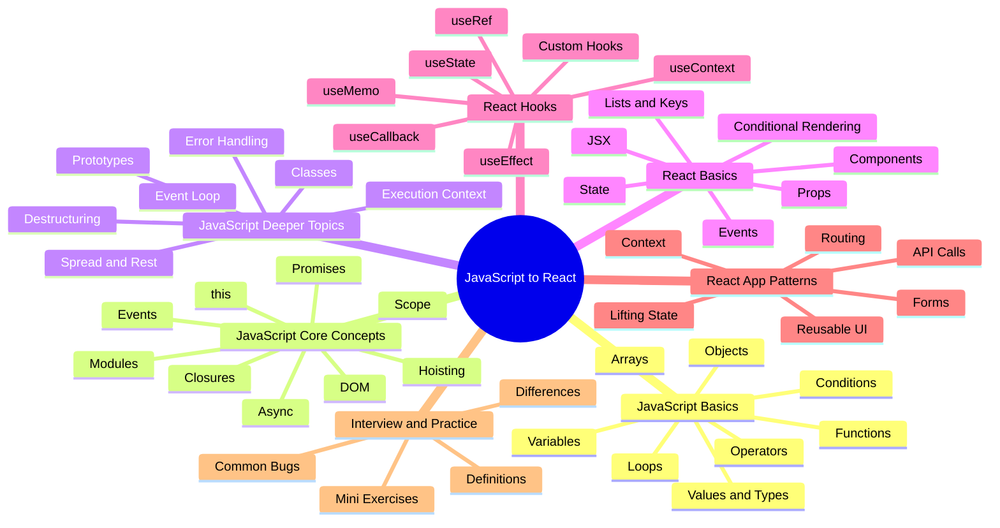
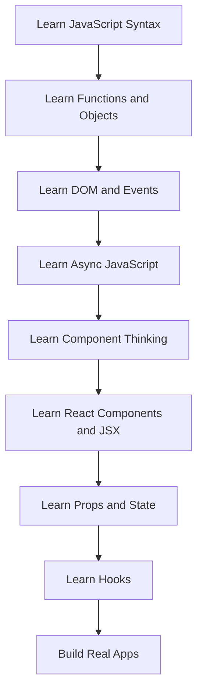

# JavaScript and React Overview and Mind Map

This file gives the big-picture view first, then the deeper files expand each branch.

## 1. Big-picture learning roadmap

The right learning sequence is:

1. Learn how JavaScript works as a language.
2. Learn how JavaScript works in the browser.
3. Learn how UI can be built from state and events.
4. Learn React as a UI library built on top of JavaScript.
5. Learn React hooks, routing, API calls, and reusable component patterns.

If JavaScript is weak, React feels confusing.

If JavaScript is strong, React becomes much easier to understand.

## 2. Mind map overview

## 3. Flow: how JavaScript leads into React

## 4. Two-level study structure

### Basic level

The basic level should answer:

- What is this concept?
- Why does it exist?
- What is the simplest way to use it?
- What problem does it solve?

### Intermediate level

The intermediate level should answer:

- How does it behave internally?
- What mistakes do beginners make?
- When should I use it and when should I avoid it?
- How does it affect architecture and performance?

## 5. What you must know before learning React well

The most important JavaScript topics for React are:

- variables and values
- functions
- objects and arrays
- array methods like `map`, `filter`, `find`
- destructuring
- spread syntax
- scope
- closures
- events
- promises and `async/await`
- modules (`import` and `export`)

If these are weak, React code will look harder than it really is.

## 6. What React actually is

React is a JavaScript library for building user interfaces.

React helps you:

- break UI into components
- describe UI using JSX
- store data in state
- update UI automatically when state changes

The most important mental model is:

"In React, UI is a function of state."

## 7. What makes React feel confusing to beginners

Usually it is not React itself. It is the combination of:

- JavaScript functions
- JavaScript objects
- browser events
- JSX syntax
- hooks
- component composition

Once these pieces become familiar, React becomes much more logical.

## 8. Recommended study method

For every new topic:

1. Read the definition.
2. Read the example.
3. Type the example yourself.
4. Change the example slightly.
5. Explain it in plain words.

That is how these notes are intended to be used.
