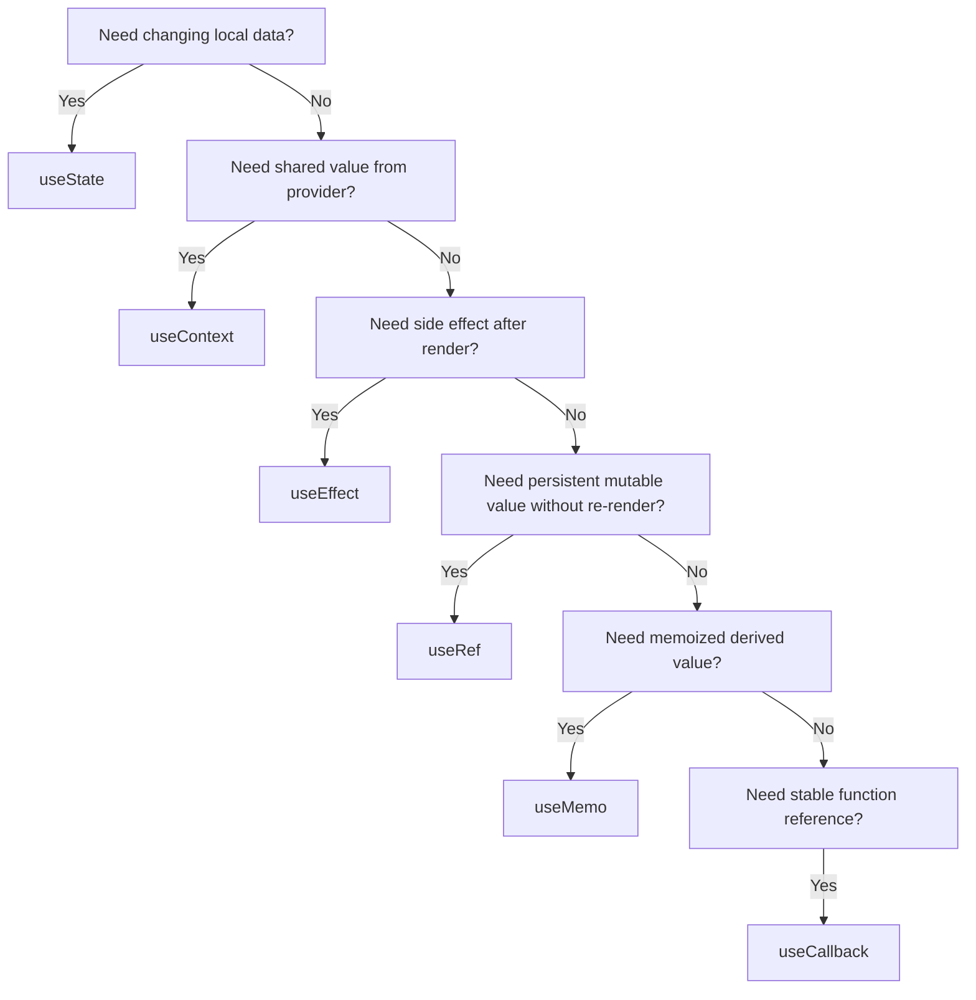

# React Hooks Deep Dive

This file focuses on hooks in detail. Hooks are one of the most important parts of modern React.

## 1. What hooks are

Hooks are functions provided by React that let function components use React features such as:

- state
- side effects
- context
- refs
- memoization

Before hooks, many of these capabilities were mainly associated with class components.

Now, hooks make function components powerful enough for most React work.

## 2. Why hooks exist

Function components are simple and easy to read, but by default they do not have:

- internal state
- lifecycle-like behavior
- reusable stateful logic

Hooks solve that problem.

## 3. Rules of hooks

These rules are critical:

- Call hooks only at the top level of a component or custom hook.
- Do not call hooks inside loops, conditions, or nested non-hook functions.
- Call hooks only from React function components or custom hooks.

Why:

React tracks hook state by call order. If the call order changes, React cannot match state correctly.

## 4. `useState`

`useState` gives local state to a function component.

Syntax:

```jsx
const [value, setValue] = useState(initialValue);
```

### Example

```jsx
import { useState } from "react";

function Counter() {
  const [count, setCount] = useState(0);

  return (
    <div>
      <p>{count}</p>
      <button onClick={() => setCount(count + 1)}>Increase</button>
    </div>
  );
}
```

### Important points

- `useState` returns an array
- first value is current state
- second value is setter function
- calling setter triggers re-render

### Functional updates

Use when next state depends on previous state:

```jsx
setCount((prev) => prev + 1);
```

This is safer in cases with multiple updates.

### When to use `useState`

Use it for:

- form fields
- toggle states
- loading flags
- selected tabs
- fetched data owned by a component

## 5. `useEffect`

`useEffect` runs side effects after render.

Syntax:

```jsx
useEffect(() => {
  // effect logic
  return () => {
    // cleanup logic
  };
}, [dependencies]);
```

### Example: fetch on mount

```jsx
import { useEffect, useState } from "react";

function Users() {
  const [users, setUsers] = useState([]);

  useEffect(() => {
    const load = async () => {
      const response = await fetch("/api/users");
      const data = await response.json();
      setUsers(data);
    };

    load();
  }, []);

  return <div>{users.length} users</div>;
}
```

### Dependency meanings

- `[]`: run once after initial mount
- `[value]`: run again when `value` changes
- no array: run after every render

### Cleanup example

```jsx
useEffect(() => {
  const id = setInterval(() => {
    console.log("tick");
  }, 1000);

  return () => clearInterval(id);
}, []);
```

Cleanup is important for:

- timers
- subscriptions
- event listeners
- network connections

### Common beginner mistake

Using `useEffect` for logic that does not need to be an effect.

If something is just a value derived from props/state, compute it directly or with `useMemo`. Effects are for side effects.

## 6. `useRef`

`useRef` stores a value that persists across renders without causing re-renders when it changes.

Syntax:

```jsx
const ref = useRef(initialValue);
```

### DOM example

```jsx
import { useRef } from "react";

function FocusInput() {
  const inputRef = useRef(null);

  const focusInput = () => {
    inputRef.current.focus();
  };

  return (
    <div>
      <input ref={inputRef} />
      <button onClick={focusInput}>Focus</button>
    </div>
  );
}
```

### Mutable value example

```jsx
const renderCount = useRef(0);
renderCount.current += 1;
```

Why not `useState` for that?

Because changing a ref does not trigger re-render, which is useful for internal bookkeeping.

## 7. `useMemo`

`useMemo` memoizes a computed value.

Syntax:

```jsx
const value = useMemo(() => computeSomething(a, b), [a, b]);
```

### Example

```jsx
import { useMemo, useState } from "react";

function NumberList() {
  const [numbers] = useState([1, 2, 3, 4, 5]);
  const [min, setMin] = useState(3);

  const filtered = useMemo(() => {
    return numbers.filter((n) => n >= min);
  }, [numbers, min]);

  return (
    <div>
      <button onClick={() => setMin(4)}>Min 4</button>
      <p>{filtered.join(", ")}</p>
    </div>
  );
}
```

### When to use it

- expensive calculations
- derived values reused in render
- keeping object/value identity stable when needed

### Do not overuse it

Use it when it improves clarity or avoids repeated work, not as a default habit for everything.

## 8. `useCallback`

`useCallback` memoizes a function reference.

Syntax:

```jsx
const fn = useCallback(() => {
  ...
}, [deps]);
```

### Example

```jsx
import { useCallback, useState } from "react";

function Example() {
  const [count, setCount] = useState(0);

  const handleLog = useCallback(() => {
    console.log(count);
  }, [count]);

  return <button onClick={handleLog}>Log</button>;
}
```

### When to use it

- when passing functions to memoized children
- when function identity matters
- when used inside dependency arrays

### Difference from `useMemo`

- `useMemo` memoizes a value
- `useCallback` memoizes a function

## 9. `useContext`

`useContext` reads a value from React Context.

Context is used for shared data that many components need.

### Create a context

```jsx
import { createContext, useContext } from "react";

const ThemeContext = createContext("light");
```

### Provide a value

```jsx
function App() {
  return (
    <ThemeContext.Provider value="dark">
      <Toolbar />
    </ThemeContext.Provider>
  );
}
```

### Consume it

```jsx
function Toolbar() {
  const theme = useContext(ThemeContext);
  return <p>Theme: {theme}</p>;
}
```

### When to use context

Good for:

- current user
- theme
- language
- auth
- shared global UI state

Do not use context for every small local value.

## 10. Custom hooks

A custom hook is a function that:

- starts with `use`
- uses one or more React hooks
- extracts reusable stateful logic

Example:

```jsx
import { useEffect, useState } from "react";

function useWindowWidth() {
  const [width, setWidth] = useState(window.innerWidth);

  useEffect(() => {
    const handleResize = () => setWidth(window.innerWidth);
    window.addEventListener("resize", handleResize);

    return () => window.removeEventListener("resize", handleResize);
  }, []);

  return width;
}
```

Use it:

```jsx
function Example() {
  const width = useWindowWidth();
  return <p>Width: {width}</p>;
}
```

Custom hooks are how you reuse hook-based behavior cleanly.

## 11. Hook decision guide



## 12. Common hook combinations

### `useState` + `useEffect`

Very common for API loading:

- state stores data and loading flag
- effect fetches data

### `useState` + controlled form

Very common for forms:

- state stores input values
- `onChange` updates them

### `useRef` + `useEffect`

Common for:

- outside click logic
- event listeners
- DOM integration

### `useContext` + custom hooks

Often used to create clean wrappers:

```jsx
function useAuth() {
  return useContext(AuthContext);
}
```

## 13. Hook mistakes to avoid

- Calling hooks inside conditions
- Forgetting dependencies in `useEffect`
- Putting non-effect logic into `useEffect`
- Mutating state objects/arrays directly
- Using `useMemo` and `useCallback` everywhere without reason
- Expecting `setState` to update immediately in the same line of code

## 14. Important interview questions

### What is a hook?

A hook is a React function that lets function components use features like state, effects, context, refs, and memoization.

### What does `useState` do?

It adds local state to a function component.

### What does `useEffect` do?

It runs side effects after rendering and can re-run when dependencies change.

### What is the difference between `useRef` and `useState`?

`useState` triggers re-render when updated. `useRef` stores mutable values without triggering re-render.

### What is the difference between `useMemo` and `useCallback`?

`useMemo` memoizes a computed value. `useCallback` memoizes a function reference.

### What is a custom hook?

A reusable function that uses React hooks to share stateful logic.

## 15. Practical mini examples

### Toggle example

```jsx
function Toggle() {
  const [open, setOpen] = useState(false);

  return (
    <button onClick={() => setOpen((prev) => !prev)}>
      {open ? "Open" : "Closed"}
    </button>
  );
}
```

### Fetch example with loading and error

```jsx
function UserLoader() {
  const [users, setUsers] = useState([]);
  const [loading, setLoading] = useState(false);
  const [error, setError] = useState("");

  const loadUsers = async () => {
    setLoading(true);
    setError("");

    try {
      const response = await fetch("/api/users");
      const data = await response.json();
      setUsers(data);
    } catch (err) {
      setError("Failed to load users");
    } finally {
      setLoading(false);
    }
  };

  useEffect(() => {
    loadUsers();
  }, []);

  if (loading) return <p>Loading...</p>;
  if (error) return <p>{error}</p>;

  return <p>{users.length} users loaded</p>;
}
```

These patterns appear again and again in real React code.
